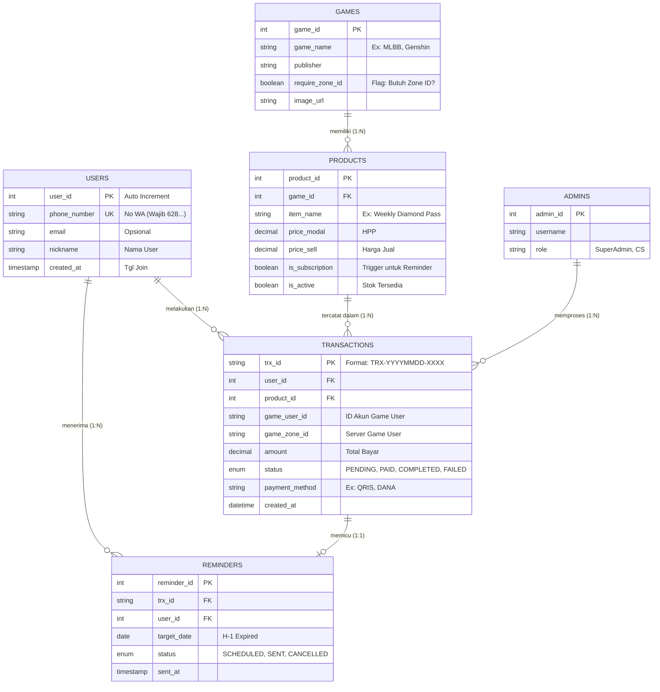

# ENTITY RELATIONSHIP DIAGRAM (ERD)

| Atribut Dokumen | Detail |
| :--- | :--- |
| **Nama Proyek** | riziqstore.idn (Scalable Architecture) |
| **Fase Implementasi** | Fase 2 (Automation & Database Integration) |
| **Versi Dokumen** | 1.0 |
| **Tanggal** | 23 Desember 2025 |
| **Disiapkan Oleh** | Senior System Analyst riziqstore.idn |

---

## 1. Pendahuluan

### 1.1 Tujuan Desain Database
Meskipun fase MVP (*Minimum Viable Product*) saat ini menggunakan Google Sheets sebagai penyimpanan data sementara, dokumen ERD ini dirancang sebagai cetak biru (*blueprint*) pengembangan sistem di **Bulan ke-5**. Desain ini mempersiapkan **riziqstore.idn** untuk beralih ke Database Relasional (SQL) guna menangani ribuan transaksi dan otomasi fitur *Reminder*.

### 1.2 Lingkup Data
Skema database ini mencakup pengelolaan data Pengguna (User), Katalog Game & Produk, Riwayat Transaksi, dan Jadwal Notifikasi (Reminder).

---

## 2. Diagram Visual (Mermaid.js)

Berikut adalah visualisasi hubungan antar entitas menggunakan standar notasi *Crow's Foot*.

---

## 3. Kamus Data (*Data Dictionary*)

Berikut adalah rincian spesifikasi atribut untuk setiap entitas yang akan diimplementasikan pada database relasional (SQL) di masa depan.

### 3.1 Tabel: USERS
Menyimpan data identitas pelanggan. Karena sistem *No-Login*, identifikasi utama bergantung pada Nomor WhatsApp.
| Nama Kolom | Tipe Data | Keterangan |
| :--- | :--- | :--- |
| `user_id` | INT (PK, Auto Inc) | ID unik internal sistem. |
| `phone_number` | VARCHAR(15) | **Unique Key**. Nomor WhatsApp pengguna (Format: 628...). |
| `nickname` | VARCHAR(50) | Nama panggilan (Opsional, didapat dari chat WA). |
| `created_at` | TIMESTAMP | Tanggal pertama kali user bertransaksi. |

### 3.2 Tabel: GAMES
Menyimpan konfigurasi kategori game untuk kebutuhan Frontend.
| Nama Kolom | Tipe Data | Keterangan |
| :--- | :--- | :--- |
| `game_id` | INT (PK) | ID unik game. |
| `game_name` | VARCHAR(50) | Nama Game (Contoh: Mobile Legends). |
| `require_zone_id` | BOOLEAN | **Logic Flag**. Jika `TRUE`, Frontend wajib menampilkan input kolom Zone ID. |

### 3.3 Tabel: PRODUCTS
Menyimpan daftar SKU (*Stock Keeping Unit*) dan harga.
| Nama Kolom | Tipe Data | Keterangan |
| :--- | :--- | :--- |
| `product_id` | INT (PK) | ID unik produk. |
| `game_id` | INT (FK) | Merujuk ke tabel GAMES. |
| `item_name` | VARCHAR(100) | Nama item (Contoh: Weekly Diamond Pass). |
| `price_sell` | DECIMAL(10,2) | Harga jual ke user. |
| `is_subscription` | BOOLEAN | **Trigger Flag**. Jika `TRUE`, transaksi produk ini akan memicu pembuatan data di tabel REMINDERS. |

### 3.4 Tabel: TRANSACTIONS
Menyimpan log riwayat penjualan (Sales Record).
| Nama Kolom | Tipe Data | Keterangan |
| :--- | :--- | :--- |
| `trx_id` | VARCHAR(20) (PK) | ID Transaksi (Format: TRX-YYMMDD-001). |
| `user_id` | INT (FK) | Merujuk ke tabel USERS. |
| `product_id` | INT (FK) | Merujuk ke tabel PRODUCTS. |
| `game_user_id` | VARCHAR(30) | ID Akun Game yang diinput user saat order. |
| `game_zone_id` | VARCHAR(10) | ID Server Game (Opsional). |
| `amount` | DECIMAL(10,2) | Total nilai transaksi. |
| `status` | ENUM | Status: 'PENDING', 'PAID', 'COMPLETED', 'FAILED'. |
| `created_at` | DATETIME | Waktu transaksi dibuat. |

### 3.5 Tabel: REMINDERS
Tabel operasional untuk fitur unggulan "Smart Reminder".
| Nama Kolom | Tipe Data | Keterangan |
| :--- | :--- | :--- |
| `reminder_id` | INT (PK) | ID unik reminder. |
| `trx_id` | VARCHAR(20) (FK) | Referensi ke transaksi asal. |
| `user_id` | INT (FK) | User yang akan dikirimkan pesan. |
| `target_date` | DATE | Tanggal pengiriman notifikasi (Biasanya H-1 Expired). |
| `is_sent` | BOOLEAN | Status apakah pesan sudah dikirim Admin/Bot. |

---

## 4. Spesifikasi Relasi (*Relationships Specification*)

Bagian ini menjelaskan aturan bisnis (*Business Rules*) yang mendasari hubungan antar tabel:

1.  **USERS memiliki banyak TRANSACTIONS (One-to-Many):**
    *   *Kardinalitas:* 1:N
    *   *Logika:* Satu nomor WhatsApp (User) dapat melakukan pembelian berkali-kali. Relasi ini digunakan untuk menghitung **User Retention Rate** dan **Lifetime Value (LTV)** pelanggan.

2.  **GAMES memiliki banyak PRODUCTS (One-to-Many):**
    *   *Kardinalitas:* 1:N
    *   *Logika:* Satu judul game (misal: MLBB) memiliki banyak varian produk (Diamonds, Starlight, Weekly Pass).

3.  **TRANSACTIONS memicu REMINDERS (Zero-to-One):**
    *   *Kardinalitas:* 0..1 ke 1
    *   *Logika:* 
        *   Relasi ini bersifat **Kondisional**. 
        *   Data di tabel REMINDER hanya akan dibuat **JIKA** produk yang dibeli pada tabel TRANSACTION memiliki atribut `is_subscription = TRUE`. 
        *   Jika user membeli item biasa (misal: 100 Diamond sekali beli), data Reminder tidak dibuat.

---

## 5. Catatan Implementasi (*Implementation Notes*)

Strategi penerapan database ini dibagi menjadi dua fase sesuai *roadmap* P2MW:

*   **Fase 1: MVP (Bulan 1-4)**
    *   **Teknologi:** Google Sheets / Microsoft Excel.
    *   **Implementasi:** Setiap Entitas di atas direpresentasikan sebagai "Sheet Tab" yang berbeda (Tab User, Tab Produk, Tab Transaksi).
    *   **Relasi:** Menggunakan fungsi `VLOOKUP` atau `INDEX-MATCH` untuk menghubungkan ID Produk dengan Harga, atau ID Transaksi dengan User.

*   **Fase 2: Automation (Bulan 5-6)**
    *   **Teknologi:** SQL Database (Supabase / MySQL).
    *   **Implementasi:** Migrasi data dari Excel ke Database server.
    *   **Tujuan:** Mendukung fitur *Dashboard Admin* berbasis Web dan integrasi *Bot WhatsApp Otomatis* untuk mengirim pesan Reminder tanpa campur tangan manusia.

---