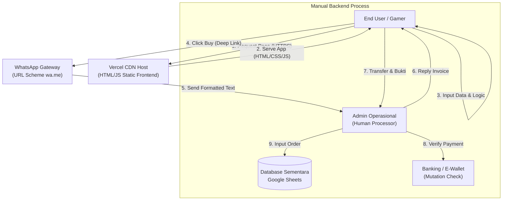

# SYSTEM DESIGN DOCUMENT (SDD)

| Atribut Dokumen | Detail |
| :--- | :--- |
| **Nama Proyek** | riziqstore.idn (Game Top Up MVP) |
| **Versi Dokumen** | 1.0 (Architecture Phase) |
| **Tanggal** | 23 Desember 2025 |
| **Status** | *Approved for Implementation* |
| **Disiapkan Oleh** | Technical Lead riziqstore.idn |

---

## 1. Pendahuluan

### 1.1 Tujuan
Dokumen Desain Sistem ini bertujuan untuk memberikan gambaran komprehensif mengenai arsitektur teknis **riziqstore.idn**. Dokumen ini menjelaskan bagaimana komponen Frontend, Integrasi WhatsApp, dan Operasional Manual saling terhubung untuk menciptakan layanan *top-up* yang stabil, aman, dan efisien biaya (*Cost-Effective*) selama fase inkubasi P2MW.

### 1.2 Pendekatan Arsitektur
Sistem ini mengadopsi pendekatan **"Serverless Static Frontend"** yang dipadukan dengan **"Concierge Backend Model"**.
*   **Frontend:** Menangani interaksi user dan validasi data secara otomatis.
*   **Backend:** Digantikan oleh tenaga manusia (Admin) yang dibantu oleh *tools* produktivitas (Google Sheets) untuk memproses logika bisnis kompleks.

---

## 2. Arsitektur Sistem Tingkat Tinggi (*High-Level Architecture*)

Berikut adalah diagram alur data global yang menggambarkan perjalanan data dari perangkat pengguna hingga ke pencatatan admin.

---

### Penjelasan Alur Data (*Data Flow Description*)

Merujuk pada diagram arsitektur di atas, berikut adalah detail perjalanan data dalam sistem:

1.  **Request (Permintaan):** Pengguna mengakses domain `riziqstore.idn` melalui browser HP. Permintaan ini dilayani oleh *Content Delivery Network* (CDN) Vercel yang secara otomatis mengarahkan pengguna ke server terdekat (misal: Jakarta/Singapore) untuk latensi minimum.
2.  **Client-Side Processing (Pemrosesan Lokal):** Browser pengguna mengunduh dan menjalankan aset web (HTML/CSS/JS). Seluruh logika validasi input, perhitungan estimasi harga, dan logika jam operasional dijalankan di sisi klien (*browser*) tanpa membebani server.
3.  **Data Handoff (Serah Terima Data):** Saat tombol "Beli" ditekan, aplikasi melakukan *handoff* data. Sistem tidak mengirim data ke database backend, melainkan mengemasnya menjadi URL API WhatsApp (`wa.me`) dan memicu aplikasi WhatsApp terbuka di HP pengguna.
4.  **Manual Fulfillment (Penyelesaian Manual):** Admin menerima pesan terformat, memverifikasi pembayaran (cek mutasi bank/E-Wallet), dan kemudian secara manual memproses top-up ke supplier serta mencatat detail transaksi ke Google Sheets.

---

## 3. Komponen Sistem & Stack Teknologi (*Tech Stack*)

Bagian ini menjelaskan teknologi yang dipilih beserta justifikasi teknis mengapa teknologi tersebut paling tepat untuk kasus penggunaan P2MW (Fase MVP).

### 3.1 Frontend Layer (Antarmuka)
*   **Teknologi:** HTML5, CSS3 (Tailwind CSS/Bootstrap), JavaScript (Vanilla ES6+).
*   **Justifikasi:**
    *   **Efisiensi Performa:** Tanpa menggunakan *framework* berat (seperti React/Angular), ukuran total aset web bisa ditekan di bawah 100KB. Ini krusial untuk target pasar mahasiswa yang mungkin memiliki koneksi internet tidak stabil atau kuota terbatas.
    *   **Kemudahan Maintenance:** Kode HTML/JS dasar lebih mudah dipahami dan dimodifikasi oleh seluruh anggota tim mahasiswa, mempercepat kurva pembelajaran dibanding framework kompleks.

### 3.2 Hosting & Infrastructure
*   **Platform:** Vercel (Hobby Tier).
*   **Justifikasi:**
    *   **Zero Cost:** Gratis selamanya untuk proyek non-komersial/edukasi, sangat cocok untuk efisiensi anggaran P2MW.
    *   **Kecepatan CDN:** Menggunakan infrastruktur *Edge Network*, konten di-*cache* secara global sehingga akses website sangat cepat.
    *   **CI/CD Otomatis:** Integrasi mulus dengan GitHub. Setiap kali tim melakukan *push code*, website ter-*update* otomatis tanpa konfigurasi server yang rumit.

### 3.3 Gateway Komunikasi
*   **Teknologi:** WhatsApp Business API (URL Scheme).
*   **Justifikasi:**
    *   **Low Friction:** Menghilangkan hambatan *Login/Sign-up* yang sering membuat pengguna batal membeli. Pengguna Indonesia sangat nyaman bertransaksi via *chat* (*Conversational Commerce*).
    *   **Reliabilitas Tinggi:** Memanfaatkan infrastruktur server Meta/WhatsApp yang sangat stabil dan jarang *down*.

### 3.4 Database Layer (Temporary)
*   **Teknologi:** Google Sheets / Microsoft Excel Online.
*   **Justifikasi:**
    *   **Fleksibilitas:** Struktur data sangat mudah diubah (*schema-less*) saat fase pencarian kecocokan pasar (*Product-Market Fit*), tanpa perlu melakukan migrasi database yang rumit.
    *   **Kolaborasi Real-time:** Memungkinkan beberapa admin bekerja bersamaan mengelola pesanan tanpa konflik data.

---

## 4. Desain Keamanan (*Security Design*)

Meskipun sistem ini menggunakan arsitektur sederhana, aspek keamanan tetap menjadi prioritas untuk melindungi kepercayaan pengguna dan integritas transaksi.

### 4.1 Keamanan Transmisi Data
*   **HTTPS Enforcement:** Vercel dikonfigurasi untuk memaksa koneksi SSL/TLS. Ini mencegah serangan *Man-in-the-Middle* (MitM) saat pengguna mengakses website, memastikan data input tidak bisa "diintip" oleh pihak ketiga saat pengguna menggunakan WiFi publik (Kampus/Cafe).
*   **End-to-End Encryption:** Setelah data beralih ke WhatsApp, keamanan data dijamin sepenuhnya oleh protokol enkripsi E2E WhatsApp. Admin maupun penyedia internet tidak bisa membaca isi pesan di tengah jalan.

### 4.2 Privasi Data Sisi Klien (*Client-Side Privacy*)
*   **Stateless Design:** Website dirancang bersifat *stateless*. Artinya, tidak ada data sensitif (seperti User ID Game atau Nomor HP) yang disimpan secara permanen di *Local Storage* atau *Cookies* browser.
*   **Manfaat:** Melindungi privasi pengguna saat menggunakan perangkat bersama (pinjam HP teman atau di warnet/lab komputer). Data akan hilang otomatis saat tab ditutup.

### 4.3 Sanitasi Input (*Input Sanitization*)
*   **Mekanisme:** Fungsi JavaScript `sanitizeInput()` diterapkan pada setiap kolom isian formulir.
*   **Tujuan:** Mencegah pengguna menyisipkan skrip berbahaya (*XSS Payload*) atau karakter khusus yang dapat merusak format URL pesan WhatsApp yang dikirim ke Admin.

---

## 5. Rencana Infrastruktur & Deployment

### 5.1 Alur Kerja Pengembangan (Git Flow)
1.  **Local Development:** Developer menulis dan menguji kode di perangkat lokal (Laptop).
2.  **Push to GitHub:** Kode yang sudah jadi diunggah ke repositori GitHub (Branch: `main`).
3.  **Auto-Build:** Vercel mendeteksi adanya *commit* baru di GitHub.
4.  **Deployment:** Vercel memproses aset statis dan menyebarkannya ke server global dalam hitungan detik.

### 5.2 Spesifikasi Lingkungan (*Environment*)
*   **Environment Variables:** Tidak diperlukan pada fase MVP ini karena tidak ada *API Key* rahasia atau kredensial database yang disimpan di sisi *frontend*.
*   **Domain:**
    *   *Primary:* `riziqstore.idn` (Domain kustom untuk branding profesional).
    *   *Fallback:* `riziqstore.vercel.app` (Subdomain gratis bawaan Vercel).

---

## 6. Penutup

Dokumen Desain Sistem ini mengonfirmasi bahwa arsitektur **riziqstore.idn** telah dirancang dengan prinsip **KISS (Keep It Simple, Stupid)**. 

Dengan meminimalkan kompleksitas teknis di awal (tanpa backend server, tanpa database SQL), tim pengembang dapat menekan risiko kegagalan teknis dan fokus sepenuhnya pada **Validasi Bisnis** serta **Kualitas Pelayanan Pelanggan** selama program P2MW berlangsung. Arsitektur ini juga menjamin biaya operasional infrastruktur IT tetap **Rp0,-**, memaksimalkan penggunaan dana hibah untuk pemasaran dan pengembangan bisnis.