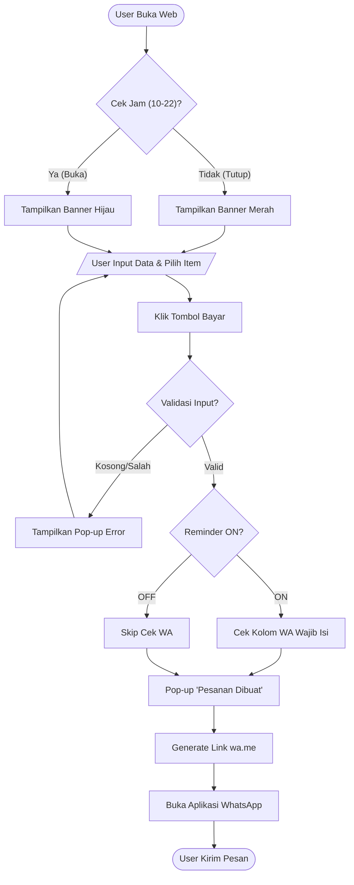
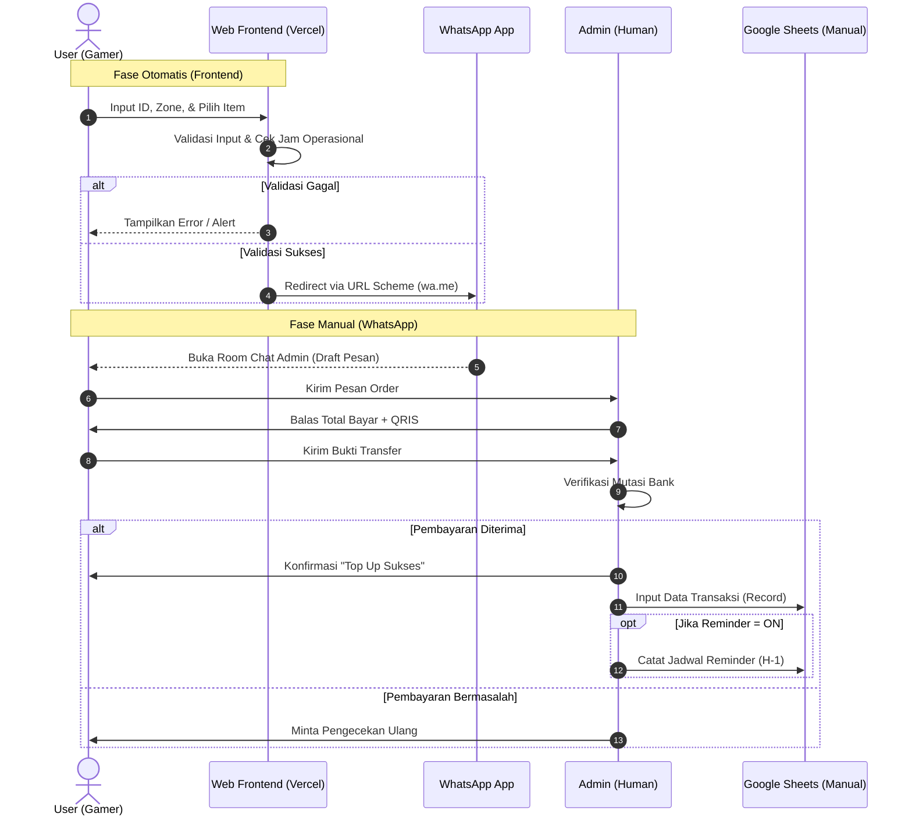

# SOFTWARE REQUIREMENTS SPECIFICATION (SRS)

| Atribut Dokumen | Detail |
| :--- | :--- |
| **Nama Proyek** | riziqstore.idn (Web-Based Game Top Up MVP) |
| **Versi Dokumen** | 1.2 (Final Technical Release) |
| **Tanggal** | 23 Desember 2025 |
| **Status** | *Approved for P2MW Submission* |
| **Disiapkan Oleh** | Tim Pengembang & System Analyst riziqstore.idn |

---

## 1. Pendahuluan (*Introduction*)

### 1.1 Tujuan
Dokumen ini mendeskripsikan spesifikasi kebutuhan perangkat lunak (*Software Requirements*) untuk **riziqstore.idn**. Dokumen ini bertujuan menjadi panduan teknis utama bagi tim pengembang (*Developers*) dalam membangun antarmuka *frontend* dan logika integrasi, serta menjadi acuan pengujian (*Quality Assurance*) untuk memastikan sistem berjalan sesuai target MVP (*Minimum Viable Product*).

### 1.2 Ruang Lingkup Produk
**riziqstore.idn** adalah platform *web application* yang menerapkan model **"Concierge MVP"** (Teknologi di depan, Manual di belakang).
Cakupan sistem meliputi:
1.  **Frontend Web Statis:** Katalog produk dan formulir pemesanan interaktif.
2.  **Logic Layer:** Validasi input, logika jam operasional, dan fitur pengingat langganan (*Subscription Reminder*).
3.  **Integration Layer:** Generator tautan otomatis ke WhatsApp Business API (`wa.me`) dengan format pesan terstruktur.
4.  **Data Handling:** Tidak ada database backend pada fase ini; persistensi data dilakukan secara manual oleh Admin di Google Sheets.

### 1.3 Definisi dan Istilah
*   **MVP (Minimum Viable Product):** Versi produk dengan fitur paling dasar untuk validasi pasar.
*   **Client-Side Scripting:** Kode program (JavaScript) yang dieksekusi di browser pengguna, bukan di server.
*   **Sanitization:** Proses pembersihan input pengguna untuk mencegah kode berbahaya.
*   **WA Gateway:** Pemanfaatan URL Scheme WhatsApp untuk mengirim data pesanan.

---

## 2. Deskripsi Umum (*Overall Description*)

### 2.1 Perspektif Produk
Sistem ini dirancang sebagai aplikasi web responsif (*Mobile-First*) yang di-*hosting* pada infrastruktur **Vercel**. Sistem bertindak sebagai perantara yang memvalidasi dan memformat data pesanan sebelum pengguna diarahkan ke saluran komunikasi WhatsApp untuk penyelesaian transaksi (pembayaran & konfirmasi).

### 2.2 Karakteristik Pengguna
| Kategori | Karakteristik | Kebutuhan Teknis |
| :--- | :--- | :--- |
| **Gamers (User)** | Usia 15-24 tahun, *Tech-savvy*, tidak sabar menunggu loading, akses via HP (4G/WiFi). | UI Dark Mode, Load Time < 2 detik, UX instan tanpa Login. |
| **Admin Toko** | Tim internal, *Standby* di WhatsApp & Google Sheets. | Format pesan WA yang rapi, data pesanan lengkap (ID/Zone). |

### 2.3 Lingkungan Operasi
*   **Frontend:** HTML5, CSS3 (Tailwind/Bootstrap), JavaScript (Vanilla ES6+).
*   **Hosting Provider:** Vercel (Edge Network).
*   **Kompatibilitas Browser:** Chrome Mobile, Safari (iOS), Samsung Internet.

---

## 3. Spesifikasi Kebutuhan Fungsional (*Specific Functional Requirements*)

Bagian ini merinci logika teknis yang harus diimplementasikan dalam kode program.

### 3.1 Modul Input & Validasi Data (*Input Validation Rules*)
Sistem harus menjamin data yang dikirim ke Admin valid untuk meminimalisir kesalahan transaksi (*Human Error*).

*   **FR-01 (ID Validation):**
    *   *Aturan:* Input `User ID` dan `Zone ID` hanya boleh menerima angka.
    *   *Implementasi:* Menggunakan RegEx `^[0-9]+$`. Jika pengguna mengetik huruf, sistem menampilkan *alert* merah: *"Hanya angka yang diperbolehkan"*.
*   **FR-02 (Length Restriction):**
    *   *Aturan:* `User ID` dibatasi maks 20 digit, `Zone ID` maks 6 digit.
*   **FR-03 (XSS Protection):**
    *   *Aturan:* Sistem melakukan sanitasi sederhana pada semua input *field* dengan menghapus karakter spesial seperti `< > / ' "` untuk mencegah injeksi skrip (*Cross-Site Scripting*).

### 3.2 Modul Logika Operasional (*Business Logic Flow*)
Sistem harus cerdas dalam merespons konteks waktu dan pilihan pengguna.

*   **FR-04 (Operational Time Check):**
    *   *Logika:*
        ```javascript
        IF (CurrentTime >= 09:00 AND CurrentTime <= 22:00) {
            Status = "OPEN";
            Button = Active;
        } ELSE {
            Status = "CLOSED";
            ShowBanner("Toko Tutup - Pesanan diproses besok jam 09.00");
        }
        ```
*   **FR-05 (Toggle Reminder Logic):**
    *   *Logika:*
        *   Jika `Checkbox Reminder` = **OFF** (Default): Kolom No. WA bersifat opsional.
        *   Jika `Checkbox Reminder` = **ON**: Kolom No. WA berubah menjadi **Wajib Diisi (Required)**, karena Admin butuh nomor tersebut untuk mengirim pengingat nanti.

### 3.3 Modul Integrasi Eksternal (*External Interface - WA API*)
Spesifikasi pembentukan URL untuk komunikasi antar-aplikasi.

*   **FR-06 (URL Encoding):** Seluruh data dinamis (Nama Item, ID, Catatan) wajib dibungkus fungsi `encodeURIComponent()` agar karakter spasi dan simbol terbaca oleh WhatsApp.
*   **FR-07 (Message Payload Structure):**
    Format pesan final yang dikirim ke `https://wa.me/628xxxxx` adalah:
    > "Halo Admin, saya mau Top Up."
    > "Game: **[Nama Game]**"
    > "Item: **[Nama Item]**"
    > "Data Akun: **[User ID]** (**[Zone ID]**)"
    > "Fitur Reminder: **[AKTIF / TIDAK AKTIF]**"
    > "No WA Buyer: **[Input User / - ]**"

---

## 4. Kebutuhan Antarmuka (*Interface Requirements*)

### 4.1 Antarmuka Pengguna (UI/UX)
*   **UI-01 (Dark Theme):** Menggunakan latar belakang gelap (#1a1a1a atau #0f172a) dengan teks kontras tinggi untuk kenyamanan mata *gamers*.
*   **UI-02 (Responsive Grid):** Daftar produk ditampilkan dalam *Grid* (2 kolom di Mobile, 4 kolom di Desktop).
*   **UI-03 (Interactive Feedback):** Tombol "Beli" berubah warna atau menampilkan animasi *spinner* saat diklik untuk memberi tahu sistem sedang bekerja.

### 4.2 Antarmuka Perangkat Lunak
*   **SI-01 (Deployment):** Kode sumber dikelola di GitHub dan terhubung otomatis (*Auto-Deploy*) ke Vercel setiap kali ada pembaruan di `main branch`.

---

## 5. Kebutuhan Non-Fungsional (*Non-Functional Requirements*)

*   **NFR-01 (Performance):** Skor *Lighthouse Performance* harus > 90. Ukuran total aset awal (*First Load*) tidak boleh melebihi 500KB.
*   **NFR-02 (Security - Privacy):** Data sensitif (ID Game) tidak boleh disimpan di *Local Storage* atau *Cookies* browser pengguna setelah tab ditutup.
*   **NFR-03 (Security - Transport):** Akses web wajib menggunakan protokol **HTTPS** (disediakan oleh Vercel).
*   **NFR-04 (Reliability):** Sistem harus tersedia (*Uptime*) 99.9% mengikuti SLA Vercel.

---

## 6. Model Sistem (*System Diagrams*)

### 6.1 Flowchart Alur Validasi (Client-Side)
Diagram ini menggambarkan logika program JavaScript di browser pengguna.



### 6.2 Sequence Diagram (End-to-End Transaction)
Diagram berikut menggambarkan urutan interaksi waktu nyata antar entitas, mulai dari pengguna mengakses web hingga data tercatat oleh Admin.



---

## 7. Kriteria Penerimaan (*Acceptance Criteria*)

Sistem MVP dinyatakan selesai, valid, dan siap diluncurkan (*Ready for Deployment*) apabila telah lulus serangkaian pengujian berikut:

### 7.1 Fungsionalitas Utama
1.  **Validasi Input:** Sistem **wajib menolak** (*disable button*) jika kolom `User ID` atau `Zone ID` mengandung karakter non-numerik (huruf/simbol) atau dibiarkan kosong.
2.  **Integrasi Deep Link:** Tombol "Beli Sekarang" berhasil memicu aplikasi WhatsApp terbuka secara otomatis (baik di Android maupun iOS) dengan pesan yang sudah terisi (*pre-filled*) sesuai format yang ditentukan.
3.  **Logika Waktu:** Sistem berhasil menampilkan *banner* peringatan "Toko Tutup" atau menonaktifkan fitur pembelian saat jam perangkat menunjukkan pukul 23:00 - 08:00 WIB.
4.  **Logika Reminder:** Jika kotak centang *Reminder* diaktifkan, teks `[REMINDER: ON]` harus muncul secara eksplisit dalam pesan WhatsApp yang dihasilkan.

### 7.2 Performa & Kompatibilitas
1.  **Kecepatan Muat:** Halaman utama harus dapat diakses dan interaktif (*Time to Interactive*) dalam waktu **< 2.5 detik** pada jaringan 4G standar (skor *Google Lighthouse* > 90).
2.  **Responsivitas:** Tampilan antarmuka (*UI*) tidak berantakan, terpotong, atau *overflow* saat diakses melalui perangkat dengan lebar layar minimum 320px (contoh: iPhone SE Gen 1).

---

## 8. Asumsi, Batasan, & Ketergantungan (*Assumptions & Dependencies*)

### 8.1 Ketergantungan Eksternal (*Dependencies*)
1.  **Layanan WhatsApp:** Keberlangsungan operasional produk sangat bergantung pada *uptime* server WhatsApp. Jika layanan WhatsApp mengalami gangguan (*down*), fitur inti pemesanan tidak dapat digunakan.
2.  **Hosting Vercel:** Ketersediaan website bergantung pada SLA (*Service Level Agreement*) infrastruktur *cloud* Vercel.
3.  **Koneksi Internet:** Aplikasi membutuhkan koneksi internet aktif di sisi pengguna untuk memuat aset *frontend* dan mengirim pesan ke API WhatsApp.

### 8.2 Batasan Sistem (*Constraints*)
1.  **Backend Manual:** Kecepatan penyelesaian pesanan (*Order Fulfillment Time*) dibatasi oleh kecepatan respon Admin manusia, bukan diproses oleh mesin/bot otomatis.
2.  **Tanpa Riwayat Pesanan:** Karena tidak menggunakan database terpusat dan fitur Login, pengguna tidak dapat melihat riwayat transaksi masa lalu mereka di dalam website.
3.  **Validasi ID:** Sistem *frontend* hanya memvalidasi format angka, tidak dapat memvalidasi apakah User ID tersebut benar-benar ada di server *game* (validasi akun asli dilakukan manual oleh Admin saat memproses).

---

## 9. Lampiran (*Appendices*)

Dokumen pendukung berikut (disimpan terpisah) merupakan bagian tak terpisahkan dari spesifikasi ini:

*   **Lampiran A:** *Mockup* Desain UI/UX High-Fidelity (Tautan Figma).
*   **Lampiran B:** Daftar Kode Produk & Harga Dasar Supplier (Tautan Google Sheets - Internal Only).
*   **Lampiran C:** SOP (Standar Operasional Prosedur) Admin Chat WhatsApp & Template Balasan Cepat (*Auto-text*).
*   **Lampiran D:** Skema Warna & Aset Grafis (*Brand Guideline* riziqstore.idn).

---