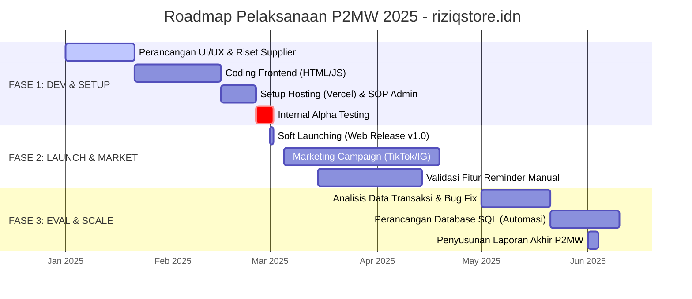

# TIMELINE PENGEMBANGAN DAN IMPLEMENTASI (ROADMAP)

| Atribut Dokumen | Detail |
| :--- | :--- |
| **Nama Proyek** | riziqstore.idn (Game Top Up Services) |
| **Durasi Program** | 6 Bulan (Januari - Juni 2025) |
| **Metode Pengembangan** | *Agile Iterative* (Hybrid MVP) |
| **Status Dokumen** | *Final Roadmap for P2MW Proposal* |
| **Disiapkan Oleh** | Project Manager riziqstore.idn |

---

## 1. Pendahuluan

Dokumen ini menguraikan rencana kerja strategis (*Strategic Roadmap*) untuk pelaksanaan program P2MW 2025. Jadwal ini dibagi menjadi tiga fase utama: **(1) Pengembangan & Setup**, **(2) Peluncuran & Pemasaran**, dan **(3) Evaluasi & Scale-Up**.

Pendekatan yang digunakan adalah **"Iterative MVP"**, di mana produk diluncurkan dengan fitur dasar secepat mungkin untuk mendapatkan umpan balik pasar, kemudian disempurnakan secara bertahap.

---

## 2. Visualisasi Gantt Chart

Berikut adalah visualisasi jadwal kerja menggunakan diagram Gantt:

---

## 3. Rincian Aktivitas Bulanan (*Monthly Activity Breakdown*)

Berikut adalah detail rencana kerja strategis yang dibagi menjadi tiga fase utama:

### FASE 1: PENGEMBANGAN MVP & INFRASTRUKTUR (Bulan 1-2)
**Fokus:** Membangun fondasi teknis yang stabil dan menyiapkan standar operasional (SOP) mengingat backend masih dijalankan secara manual.

#### **Bulan 1: Perencanaan & Desain**
*   **Minggu 1-2: Finalisasi Produk & Riset Supplier**
    *   Melakukan komparasi harga modal (*COGS*) dari 3-5 agregator game (H2H) untuk memastikan margin profit yang sehat.
    *   Menetapkan strategi harga jual (*Pricing Strategy*) khusus mahasiswa.
*   **Minggu 3-4: UI/UX & Prototyping**
    *   Merancang desain antarmuka *High-Fidelity* di Figma dengan tema *Dark Mode*.
    *   Menyusun *copywriting* template pesan WhatsApp agar terlihat profesional.

#### **Bulan 2: Coding & Setup Sistem**
*   **Minggu 1-3: Implementasi Frontend**
    *   *Coding* struktur web menggunakan HTML5/CSS3 dan JavaScript Vanilla.
    *   Implementasi logika validasi input (RegEx) dan integrasi API WhatsApp (`wa.me`).
*   **Minggu 4: Deployment & SOP**
    *   *Deploy* kode final ke Vercel (*Production Env*).
    *   Menyusun dokumen SOP Admin: "Alur Verifikasi Pembayaran", "Cara Input Transaksi ke Excel", dan "SOP Pengiriman Reminder".
    *   *Alpha Testing*: Simulasi transaksi internal oleh tim untuk memastikan tidak ada *bug*.

---

### FASE 2: PELUNCURAN & VALIDASI PASAR (Bulan 3-4)
**Fokus:** Akuisisi pengguna awal (*User Acquisition*) dan pembuktian validitas fitur "Reminder".

#### **Bulan 3: Soft Launching (Go-to-Market)**
*   **Minggu 1: Rilis Publik v1.0**
    *   Publikasi tautan website di seluruh kanal media sosial riziqstore.idn.
    *   Penyebaran informasi secara organik di grup WhatsApp kampus/komunitas.
*   **Minggu 2-4: Promosi Awal**
    *   Menjalankan promo "Diskon Opening" (Disubsidi dari dana operasional P2MW).
    *   Mengumpulkan testimoni/feedback awal dari 50 pengguna pertama.

#### **Bulan 4: Marketing & Operasional Intensif**
*   **Minggu 1-4: Kampanye Digital & Eksekusi Reminder**
    *   Produksi konten rutin (TikTok/IG Reels) dengan *hook*: "Solusi Anti Lupa Paket Game".
    *   Eksekusi manual pengiriman pesan Reminder H-1 kepada user yang berlangganan di Bulan ke-3.
    *   Monitoring *Response Time* Admin (Target: < 5 menit).

---

### FASE 3: EVALUASI & PENGEMBANGAN LANJUTAN (Bulan 5-6)
**Fokus:** Analisis data untuk laporan P2MW dan persiapan skala bisnis (*Scale-Up*).

#### **Bulan 5: Evaluasi Kinerja (Data-Driven)**
*   **Minggu 1-2: Analisis Retensi Pengguna**
    *   Menghitung *Retention Rate*: Berapa % user yang dikirimi Reminder melakukan pembelian ulang?
    *   Rekapitulasi omzet dan laba bersih.
*   **Minggu 3-4: Perbaikan & Optimasi**
    *   Perbaikan *bug* tampilan (*UI Glitch*) berdasarkan laporan pengguna.
    *   Optimasi aset gambar untuk mempercepat *loading speed*.

#### **Bulan 6: Scale-Up & Pelaporan Akhir**
*   **Minggu 1-2: Perencanaan Otomasi (Menuju Fase 2)**
    *   Merancang skema Database SQL untuk menggantikan Google Sheets.
    *   Riset vendor Bot WhatsApp (seperti Wuzzi/Fonnte) untuk otomatisasi pesan di masa depan.
*   **Minggu 3-4: Administrasi P2MW**
    *   Penyusunan Laporan Pertanggungjawaban Keuangan.
    *   Penyusunan Laporan Akhir Kegiatan.
    *   Persiapan materi presentasi untuk Expo/Reviewer P2MW.

---

## 4. Manajemen Risiko (*Risk Management*)

Berikut adalah identifikasi potensi kendala yang mungkin terjadi beserta strategi mitigasinya:

| Risiko Potensial | Dampak | Strategi Mitigasi |
| :--- | :--- | :--- |
| **Admin Overload** | Pesanan lambat diproses saat trafik tinggi (Human Error meningkat). | Menambah jadwal *shift* admin antar anggota tim; Membatasi jam operasional website via sistem otomatis. |
| **WhatsApp Banned** | Nomor WA Admin diblokir karena dianggap spam oleh pihak Meta. | Menggunakan WhatsApp Business resmi; Menghindari *broadcast* massal dalam waktu singkat; Menggunakan narasi personal (bukan robot). |
| **Gangguan Supplier** | Stok *game* kosong atau server *top-up* gangguan. | Menjalin kerjasama dengan 2-3 supplier cadangan (*Backup Aggregator*) agar operasional tidak terhenti. |
| **Keterlambatan Dev** | Jadwal *launching* mundur dari timeline. | Menggunakan *template* HTML *open-source* yang dimodifikasi untuk mempercepat proses *coding*. |

---

## 5. Indikator Keberhasilan Tahapan (*Key Milestones*)

Proyek ini dianggap berhasil dalam kerangka P2MW jika mencapai target berikut:

1.  **Technical Milestone (Bulan 2):** Website `riziqstore.idn` live di Vercel, fitur validasi input berjalan 100% akurat, dan integrasi WhatsApp lancar.
2.  **Operational Milestone (Bulan 4):** Mencapai minimal 100 transaksi kumulatif; Waktu rata-rata penyelesaian order < 10 menit.
3.  **Business Milestone (Bulan 5):** Fitur *Reminder* berhasil mengonversi minimal 20% pengguna untuk melakukan pembelian ulang (*Repeat Order*).
4.  **Administrative Milestone (Bulan 6):** Laporan keuangan dan laporan akhir kegiatan tersusun lengkap, serta *blueprint* sistem otomatisasi siap untuk pengembangan pasca-pendanaan.

---